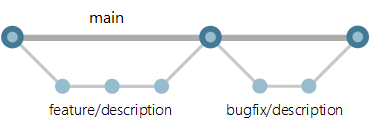

# Branching strategy

*Image taken from [microsoft learn](https://learn.microsoft.com/en-us/azure/devops/repos/git/git-branching-guidance?view=azure-devops)*

For our branching strategy we defined a simple feature branching strategy. For every feature, bugfix or maintance work we only need to create a branch from the main and merge it back.

## Branch naming schema

For the sake of simplicity, we will only use the following three schemas for creating branches:

New feature

`feature/[name-of-the-feature]`

Fixing a bug

`bugfix/[name-of-the-bug]`

Maintance work (eg. dependency updates, update of documentation)

`chore/[name-of-the-topic]`

## Commit message schema

Please refer to the [semantic release documentation](https://github.com/semantic-release/semantic-release#how-does-it-work) to have a overview on the commit message. 

In this project we will only use following prefixed
- feat -> for new features
- fix -> for a bugfix
- chore -> for maintenance work
- docs -> updates to the documentation